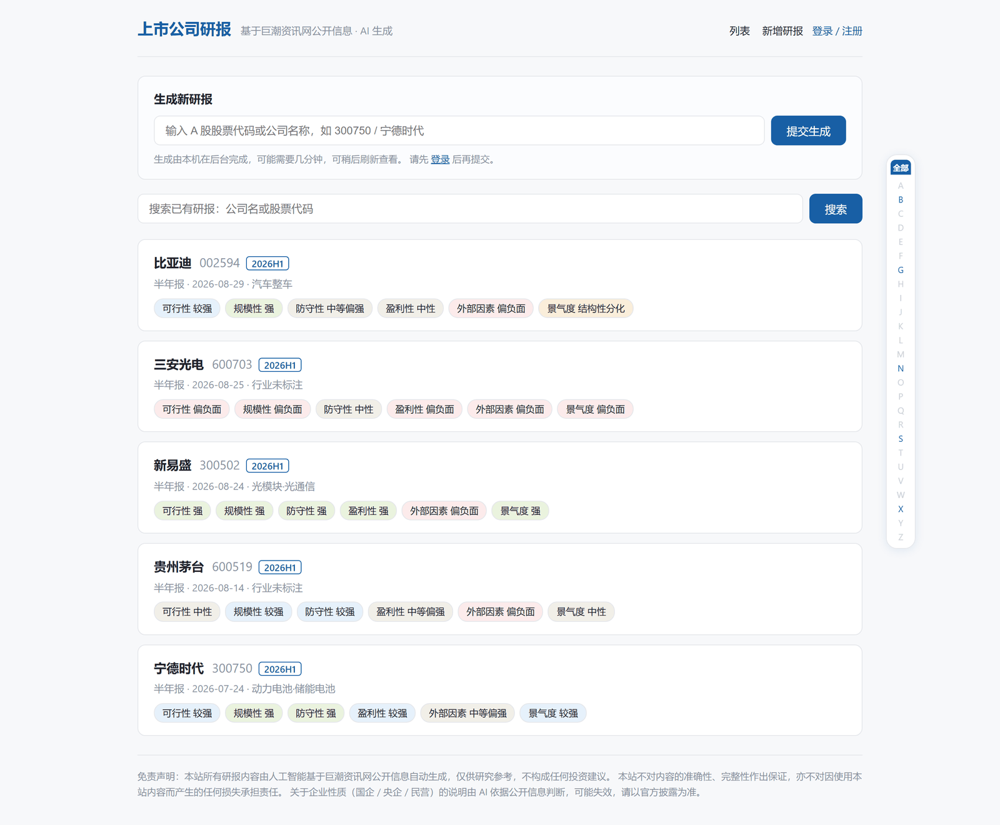
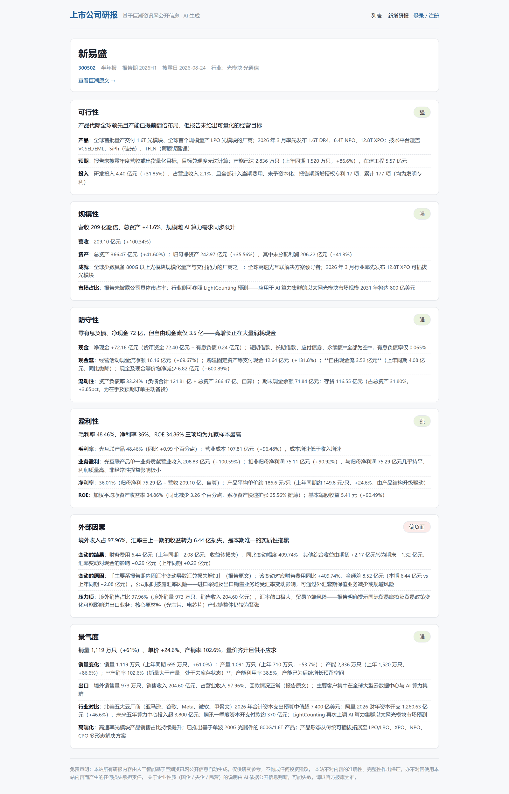
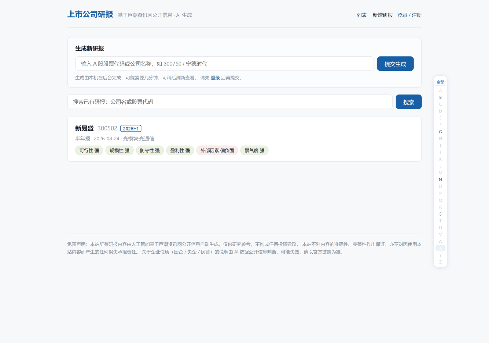
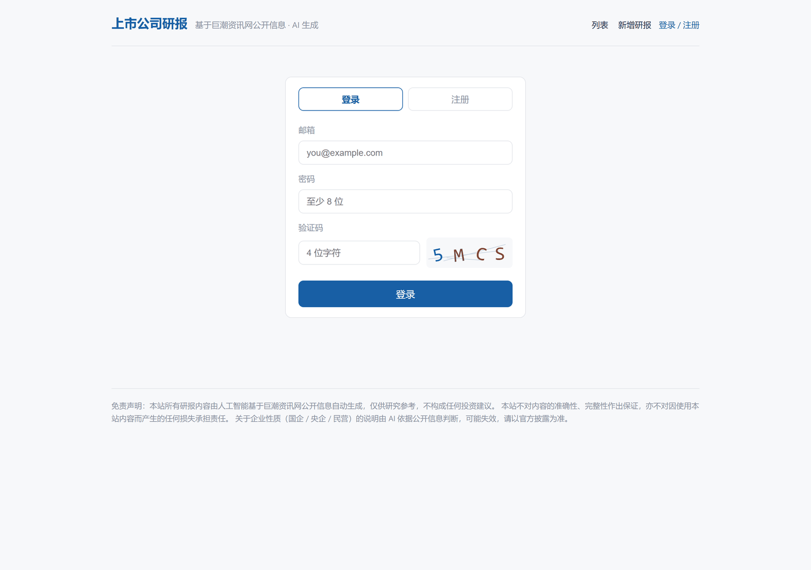

# 上市公司研报站点

> **输入股票代码 → 自动抓取巨潮资讯网定期报告 → AI 按六维度评判 → 生成结构化研报并入库展示。**
>
> 一个**从抓取、AI 生成，到鉴权、限流、部署、备份、灾备重建全链路自己实现**的中小型 Web 应用。


---

## 效果预览

| 研报列表 | 研报详情 |
|:---:|:---:|
|  |  |
| **行业筛选** | **登录鉴权** |
|  |  |

---

## 这份代码里值得一看的地方

> 给「想快速判断工程能力」的读者 —— 挑的是**能体现取舍与踩过坑**的点，不是功能清单。

| # | 点 | 说明 |
|:-:|:---|:---|
| 1 | **无域名 / 无备案下跑 HTTPS** | 用 Caddy 内置 CA 自签；并处理了「CA 中间证书默认只有 7 天，会把叶子证书**静默压缩**」这个陷阱 |
| 2 | **双层限流，分工明确** | fail2ban 治慢速爆破（拦在网络层、不耗应用资源），slowapi 治瞬时爆发；配额走 Redis，**Redis 挂掉自动降级为内存计数** |
| 3 | **边沿触发的健康告警** | 同一故障**只报一次**、恢复时再报 —— 避免"每分钟一条"把告警刷成噪音，最后没人看 |
| 4 | **接口文档 fail-closed** | `/docs` 默认**关闭**（而非默认开再记得关）；且反代层必须**显式透传**，否则会被 SPA 回退吞成 HTTP 200，语义上等于告诉扫描者"路径存在" |
| 5 | **幂等部署 + 自动备份 + 回滚** | `deploy.sh` 可重复执行；覆盖前自动备份；代码与数据分离回滚 |
| 6 | **灾备演练真的跑过** | ③ 级全清空重建演练实测端到端 **RTO ≈ 18 分钟**，4 个服务无人工干预自动恢复 |
| 7 | **打包即安全闸门** | `pack.sh` 强制归一 LF、**扫描并拒绝含凭证的产物**、排除数据库与密钥；行尾用字节级校验而非"看起来对" |
| 8 | **结论可回溯** | 六维度不只给评级，还附一句话结论 + 带标签的逐条证据，能回到公告原文 —— 而不是给一个孤立的分值 |

---

## 一、这个项目是什么

面向 A 股上市公司的**定期报告（年报 / 半年报 / 季报）**，自动完成：

```
股票代码
   ↓  抓取巨潮资讯网公告 PDF
   ↓  抽取全文（文本层 / 图像层双流水线）
   ↓  AI 按六维度评判，逐条给出「结论 + 证据」
   ↓  生成 report.json（46 字段契约）
   ↓  写入 SQLite（唯一事实源）+ Redis（加速层）
   ↓  Web 站点展示
```

### 六维度评判框架

| # | 维度 | 关注 | 评级档位 |
|:-:|:---|:---|:---|
| 1 | **可行性** | 目标兑现进度、技术落地、投入强度 | 强 / 较强 / 中等偏强 / 中性 / 结构性分化 / 偏负面 |
| 2 | **规模性** | 营收、资产、市占率、行业地位 | 同上 |
| 3 | **防守性** | 净现金、现金流、流动性缓冲 | 同上 |
| 4 | **盈利性** | 毛利率、净利率、ROE、分部盈利质量 | 同上 |
| 5 | **外部因素** | 汇率、政策、原材料、贸易壁垒 | 同上 |
| 6 | **景气度** | 销量/产量趋势、出口、行业对比 | 同上 |

> 每个维度**不只有评级**，还带 `conclusion`（一句话结论）与 `evidence[]`（带标签的逐条证据）。
> 设计取向：**让结论可回溯到原文**，而不是给一个孤立的分值。

---

## 二、技术栈与架构

```
访客浏览器
    ↓  https://<站点>   （80 仅做 301 跳转）
┌──────────────────────────────────────────┐
│  Caddy         反向代理 + 静态托管        │
│    /api/*   →  127.0.0.1:8081            │
│    其他      →  frontend/dist/            │
└──────────────────────────────────────────┘
                    ↓
      FastAPI（uvicorn，单 worker，仅监听回环）
                    ↓
   SQLite（唯一事实源）   +   Redis（限流计数 / 加速层）
                    ↑
        本机 Worker（抓取 + AI 生成，定时拉取任务）
```

| 层 | 选型 | 为什么 |
|:---|:---|:---|
| 后端 | **FastAPI** + uvicorn | 类型清晰、自带校验；单 worker 因为 SQLite 是单写者 |
| 前端 | **Vue 3** + Vite | 构建产物是纯静态，交给 Caddy 托管，不必再起 Node 服务 |
| 数据库 | **SQLite** | 单机中小规模足够；`content_json` 是唯一事实源 |
| 缓存/限流 | **Redis** | 存限流计数（重启不丢）；丢了也能从 SQLite 重建 |
| 网关 | **Caddy** | 自动 HTTPS、配置极简、静态托管与反代一体 |
| 部署 | systemd + 脚本 | 幂等可重跑，覆盖前自动备份 |

---

## 三、目录结构

```
research-reports/
├── backend/                    FastAPI 后端
│   ├── app/
│   │   ├── main.py             应用入口（注册路由、限流器、异常处理）
│   │   ├── config.py           配置读取 + 启动自检
│   │   ├── schema.py           建表与列迁移（唯一来源，勿另立）
│   │   ├── ratelimit.py        限流配额统一管理（LIMITS 字典）
│   │   ├── security.py         密码哈希（bcrypt）、令牌签发
│   │   ├── routes/             路由：auth / tasks / public / me / notifications / …
│   │   └── services/cninfo.py  巨潮公告检索
│   ├── scripts/
│   │   ├── init_db.py          建库（幂等）
│   │   └── seed_data.py        从 reports/ 灌入研报
│   ├── app.env.example         ← 复制成 app.env 再填值
│   └── requirements.txt
│
├── frontend/                   Vue 3 前端
│   └── src/views/              ReportList / ReportDetail / NewReport / Auth / Profile
│
├── worker/                     本机生成端（跑在你自己的电脑上）
│   ├── worker.py               抓取 + 调用技能包 + 回传结果
│   ├── server_watch.py         站点健康探测（边沿触发，不重复骚扰）
│   └── worker.env.example      ← 复制成 worker.env 再填值
│
├── deploy/                     部署与运维
│   ├── deploy.sh               一键部署 / 重建（幂等）
│   ├── pack.sh                 本机打包（构建前端 + 归一 LF + 排除凭证）
│   ├── rollback.sh             回滚代码（不动数据）
│   ├── backup.sh               备份 SQLite + Redis
│   ├── offsite-backup.py       打包加密 + 邮件外发（异地）
│   ├── healthcheck.py          服务存活监测
│   ├── alert.py                备份新鲜度 / 磁盘 / 内存告警
│   ├── Caddyfile               反代 + 静态托管（自签 HTTPS 版）
│   ├── Caddyfile.le-ip         Let's Encrypt IP 证书版（待用）
│   ├── fail2ban-*              fail2ban 过滤器与 jail
│   └── README.md               ★ 部署与运维手册（排障看这份）
│
├── reports/                    研报 JSON（46 字段契约）
└── docs/screenshots/           站点截图
```

---

## 四、跑起来（本机）

### 前置

| 需要 | 版本 | 说明 |
|:---|:---|:---|
| Python | 3.11+ | 后端与 Worker |
| Node.js | 18+ | 只用于构建前端 |
| Redis | 任意 | 限流计数用；挂了会自动降级为内存计数 |

### 1. 后端

```bash
cd backend

# 建虚拟环境
python -m venv venv
source venv/bin/activate          # Windows: venv\Scripts\activate
pip install -r requirements.txt

# 配置
cp app.env.example app.env
# ⚠️ 必须填 JWT_SECRET，否则起不来：
#    openssl rand -hex 32
#    （WORKER_TOKEN 也建议同时生成：openssl rand -base64 32）

# 建库 + 灌入示例研报
python scripts/init_db.py
python scripts/seed_data.py

# 启动
uvicorn app.main:app --host 127.0.0.1 --port 8081 --reload
```

本机开发建议在 `app.env` 里设 `ENABLE_DOCS=true`，这样 `/docs` 可用（**生产必须保持关闭**）。

### 2. 前端

```bash
cd frontend
npm install
npm run dev        # 开发服务器，已配好到后端的代理
# 或
npm run build      # 产物在 dist/，交给 Caddy 托管
```

> ℹ️ **前端不需要配置后端地址**。所有请求都走 `/api/...` 相对路径，
> 开发期由 Vite proxy 转发、生产期由 Caddy 反代 —— 同源，零跨域。

### 3. Worker（可跳过，除非你要生成新研报）

Worker 是「跑在你电脑上、负责实际抓取与 AI 评判」的那一端。它需要：

1. **一份六维度评判的技能包**（本仓库不含，属于外部依赖）
2. `worker.env` 配置正确

```bash
cd worker
cp worker.env.example worker.env
# 填入 SERVER_URL / WORKER_TOKEN / SKILL_DIR / VENV_PY

# 先自检（强烈建议）
python worker.py doctor

# 正常使用
python worker.py check          # 看队列，只读
python worker.py claim          # 领一个任务
python worker.py fetch 300750 2026H1
python worker.py submit <task_id> <report.json>
```

> ⚠️ **`worker.py doctor` 会逐项检查路径与连通性并给出修复指引** ——
> 配置错时它会明确报出来，而不是跑到一半才炸。
> 这一步能省掉绝大多数"技能包不好用"的误判。

---

## 五、部署（服务器）

完整流程见 **`deploy/README.md`**（那份手册包含端口分配、安全加固、备份策略、排障速查表）。

速览：

```bash
# 本机打包（会构建前端 + 校验行尾 + 排除凭证）
bash deploy/pack.sh

# 上传后，在服务器上解包并执行
sudo bash deploy/deploy.sh
```

`deploy.sh` 是**幂等**的：重复执行安全，覆盖前会自动备份，便于回滚。

---

## 六、几个值得注意的设计取舍

| 取舍 | 选择 | 理由 |
|:---|:---|:---|
| **数据源单一** | SQLite 是唯一事实源，Redis 只是加速层 | Redis 丢了可从 SQLite 重建；反过来不行 |
| **删除用软删除** | `is_deleted=1` | 数据留档，避免误删不可逆 |
| **接口文档默认关闭** | `ENABLE_DOCS=false`（fail-closed） | `/docs` 会完整暴露接口与权限要求，等于给扫描者一张地图 |
| **双层限流** | fail2ban（网络层）+ slowapi（应用层） | 慢速爆破只有前者能治；瞬时爆发只有后者反应得及 |
| **披露日期按北京时间** | 显式东八区 | 巨潮时间戳按 UTC 解析会**少一天** |
| **密码用 bcrypt** | 单向哈希，非可逆加密 | 数据库泄露也不可还原 |

---

## 七、关于本仓库的公开范围

**已包含**：全部源码、部署脚本、研报 JSON、站点截图。

**刻意未包含**（`.gitignore` 排除）：

| 排除项 | 原因 |
|:---|:---|
| `*.env`（真实配置） | 含密钥与令牌，只提供 `.example` 模板 |
| `deploy/.backup-pass`、`deploy/backup-mail.env` | 备份加密口令与邮箱授权码 |
| `backend/data/`、`*.db` | 本地数据库，含用户数据 |
| `docs/rebuild-drill-*.md` | 内部运维复盘，含服务器实例 ID、端口分配、备份邮箱服务商、快照 ID |
| `worker/.server_watch_state.json` | 告警的边沿触发状态机，进库会导致告警**静默失效** |

> **研报数据（`reports/`）是刻意保留的**：它们来自巨潮资讯网公开披露，
> 且本来就在站点上公开展示 —— 藏起来没有意义。
> 而运维文档属于**内部信息**（攻击地图），与"研究成果"是两回事。

---

## 八、许可证

**代码**以 [MIT License](LICENSE) 授权 —— 可自由使用、修改、分发，包括商业用途，
只需保留版权声明。完整条款见仓库根目录的 `LICENSE`。

**研报内容不在上述授权范围内**：`reports/` 与站点上展示的分析文本，其事实数据来自
**巨潮资讯网公开披露**的定期报告，由 AI 辅助生成，**仅供研究与学习参考，
不构成任何投资建议**。

> 若你要把本项目用于生产环境，请注意 `deploy/` 下的配置模板**均为占位符**，
> 真实密钥、邮箱、服务器地址需自行填入，并务必先读 `deploy/README.md` 的安全加固清单。

